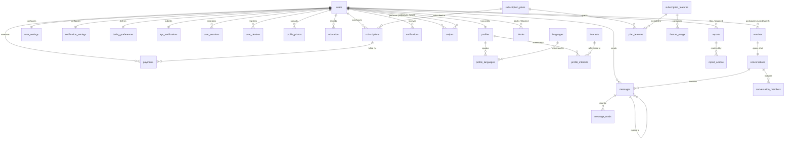

# 💖 Dating Application — PostgreSQL Database Layer Documentation

A production-grade, highly scalable, and secure PostgreSQL database layer designed for modern dating platforms. Built using **Drizzle ORM** with strict referential integrity, geospatial indexing readiness, idempotency guarantees, and granular monetization models.

---

## 📑 Table of Contents
1. [Database Overview](#1-database-overview)
2. [Technology Stack](#2-technology-stack)
3. [DB Folder Structure](#3-db-folder-structure)
4. [Purpose of Every Schema File](#4-purpose-of-every-schema-file)
5. [Complete Table List](#5-complete-table-list)
6. [Table Categorization](#6-table-categorization)
7. [Table-by-Table Purpose](#7-table-by-table-purpose)
8. [Important Columns](#8-important-columns)
9. [Primary Keys](#9-primary-keys)
10. [Foreign Keys](#10-foreign-keys)
11. [Relationships](#11-relationships)
12. [Relationship Diagram](#12-relationship-diagram)
13. [Enum & Status Fields](#13-enum--status-fields)
14. [Unique Constraints](#14-unique-constraints)
15. [CHECK Constraints](#15-check-constraints)
16. [Indexes](#16-indexes)
17. [Why Each Important Index is Useful](#17-why-each-important-index-is-useful)
18. [Seed Execution Order](#18-seed-execution-order)
19. [Migration & CLI Commands Workflow](#19-migration--cli-commands-workflow)
20. [Security Considerations](#20-security-considerations)
21. [Soft-Delete Strategy](#21-soft-delete-strategy)
22. [Cascade-Delete Strategy](#22-cascade-delete-strategy)
23. [High-Volume Table Considerations](#23-high-volume-table-considerations)
24. [Location & PostGIS Strategy](#24-location--postgis-strategy)
25. [Payment & Webhook Idempotency](#25-payment--webhook-idempotency)
26. [Message Idempotency](#26-message-idempotency)
27. [Pagination Recommendations](#27-pagination-recommendations)
28. [Production Considerations](#28-production-considerations)
29. [Optional / Future Tables](#29-optional--future-tables)
30. [Final Table Count](#30-final-table-count)

---

## 1. Database Overview
This database architecture powers a dating application with:
- **Authentication & Security**: Email, Phone OTP, Social OAuth, password reset, brute-force locking (`failed_login_attempts`, `locked_until`), session management with native PostgreSQL `INET` IP address tracking.
- **Profiles & Discovery**: Structured geospatial coordinates (`latitude`, `longitude`, `city`, `state`, `country`), multi-select preference filters stored in performant `JSONB`, language & interest tag junctions.
- **Matching & Swiping**: Canonical match pair constraints `CHECK (user1_id < user2_id)` preventing duplicate reciprocal matches, swipe decision uniqueness, and immutable `swipe_events` for ML recommendation training.
- **Real-Time Chat**: Client-generated message UUID idempotency (`client_message_id`), reply threads, soft deletion, and per-user read status receipts.
- **Trust, Safety & Moderation**: User blocking, reports, moderator action auditing (`report_actions`), structured suspensions (`user_suspensions`), and admin audit trails (`admin_audit_logs`).
- **Enterprise Monetization**: Tiered subscription plans, dynamic feature entitlements (`subscription_features`, `plan_features`), daily metered quotas (`feature_usage`), and webhook event idempotency (`subscription_events`).

---

## 2. Technology Stack
- **Database Engine**: PostgreSQL 15+ / 16+
- **ORM / Query Builder**: Drizzle ORM (`v0.45.2+`)
- **Migration Kit**: Drizzle Kit (`v0.31.10+`)
- **Connection Pool**: `node-postgres` (`pg` Pool)
- **Language**: TypeScript (`v5.0+` / `v7.0+`)
- **Runtime**: Node.js (`v20+` / `v22+`) with `tsx` for TypeScript execution

---

## 3. DB Folder Structure
```text
src/db/
├── index.ts               # Database connection pool & Drizzle ORM client initialization
├── relations.ts           # Drizzle ORM bidirectional relations for all 35 entities
├── migrate.ts             # Programmatic migration executor
├── seed.ts                # Deterministic topological order database seeder
├── reset.ts               # Clean database reset utility (drops & recreates public schema)
├── migrations/            # Auto-generated DDL SQL migration files & snapshots
│   └── meta/              # Drizzle snapshot metadata
└── schema/
    ├── index.ts           # Unified barrel export re-exporting all tables & types
    ├── independent.ts     # Master lookup & catalog tables (0 dependencies)
    ├── core.ts            # Identity, authentication, profiles, settings & devices
    ├── junction.ts        # Many-to-Many join tables with composite primary keys
    ├── dependent.ts       # Discovery, matching, messaging, safety, moderation & logs
    └── payments.ts        # Subscriptions, payments, webhook events & quota usage
```

---

## 4. Purpose of Every Schema File

| File Path | Domain / Responsibility | Rationale & Ownership |
| :--- | :--- | :--- |
| `schema/independent.ts` | Master Lookups & Catalogs | Contains entities with **zero foreign key dependencies** (`languages`, `interests`, `subscription_plans`, `subscription_features`). Root of the dependency tree. |
| `schema/core.ts` | Identity, Auth & Profile | Contains the primary account entity (`users`), candidate profile (`profiles`), active authentication tokens (`user_sessions`, `otp_verifications`, `password_reset_tokens`), push devices (`user_devices`), and 1:1 user preferences (`user_settings`, `notification_settings`). |
| `schema/junction.ts` | Many-to-Many Associations | Houses associative join tables with **composite primary keys** (`profile_languages`, `profile_interests`, `conversation_members`, `message_reads`, `plan_features`). |
| `schema/dependent.ts` | Domain Features & Safety | Contains entities dependent on users and profiles: discovery filters (`dating_preferences`), swipe state & event stream (`swipes`, `swipe_events`), matches (`matches`), chat threads (`conversations`, `messages`), trust & safety (`blocks`, `reports`, `report_actions`, `user_suspensions`, `admin_audit_logs`), and notifications (`notifications`, `push_notification_deliveries`). |
| `schema/payments.ts` | Monetization & Webhooks | Encapsulates billing transactions (`payments`), active subscription lifecycles (`subscriptions`), webhook event deduplication (`subscription_events`), and daily quota consumption tracking (`feature_usage`). |
| `schema/index.ts` | Barrel Export | Provides a single unified entrypoint exporting all tables, types (`$inferSelect`, `$inferInsert`), and constants. |

---

## 5. Complete Table List (35 Production Tables)

1. `languages`
2. `interests`
3. `subscription_plans`
4. `subscription_features`
5. `users`
6. `profiles`
7. `user_devices`
8. `user_sessions`
9. `otp_verifications`
10. `password_reset_tokens`
11. `user_login_events`
12. `user_settings`
13. `notification_settings`
14. `profile_languages`
15. `profile_interests`
16. `conversation_members`
17. `message_reads`
18. `plan_features`
19. `education`
20. `kyc_verifications`
21. `profile_photos`
22. `media_assets`
23. `dating_preferences`
24. `swipes`
25. `swipe_events`
26. `matches`
27. `conversations`
28. `messages`
29. `blocks`
30. `reports`
31. `report_actions`
32. `user_suspensions`
33. `admin_audit_logs`
34. `notifications`
35. `push_notification_deliveries`
36. `subscriptions`
37. `payments`
38. `subscription_events`
39. `feature_usage`

---

## 6. Table Categorization

```text
Database Architecture (35 Production Tables)
│
├── Independent (4 tables)
│   ├── languages
│   ├── interests
│   ├── subscription_plans
│   └── subscription_features
│
├── Core Identity & Auth (9 tables)
│   ├── users
│   ├── profiles
│   ├── user_devices
│   ├── user_sessions
│   ├── otp_verifications
│   ├── password_reset_tokens
│   ├── user_login_events
│   ├── user_settings
│   └── notification_settings
│
├── Junction / M:N Associations (5 tables)
│   ├── profile_languages
│   ├── profile_interests
│   ├── conversation_members
│   ├── message_reads
│   └── plan_features
│
├── Dependent Domain & Safety (17 tables)
│   ├── education
│   ├── kyc_verifications
│   ├── profile_photos
│   ├── media_assets
│   ├── dating_preferences
│   ├── swipes
│   ├── swipe_events
│   ├── matches
│   ├── conversations
│   ├── messages
│   ├── blocks
│   ├── reports
│   ├── report_actions
│   ├── user_suspensions
│   ├── admin_audit_logs
│   ├── notifications
│   └── push_notification_deliveries
│
└── Payments & Monetization (4 tables)
    ├── subscriptions
    ├── payments
    ├── subscription_events
    └── feature_usage
```

---

## 7. Table-by-Table Purpose

1. **`languages`**: Master list of spoken languages candidates can select for their profile.
2. **`interests`**: Master list of categorized hobbies/interests used in matching filters.
3. **`subscription_plans`**: Master catalog of premium subscription packages (Free, Gold, Platinum).
4. **`subscription_features`**: Granular feature flags and permissions available in tiers (e.g. `UNLIMITED_LIKES`, `SEE_WHO_LIKED`).
5. **`users`**: Root account entity containing credentials, security states, roles, and lockout parameters.
6. **`profiles`**: Public profile details (name, DOB, gender, height, bio, structured location).
7. **`user_devices`**: Device hardware, push tokens (APNs/FCM), and installed app versions.
8. **`user_sessions`**: Active authentication sessions, hashed refresh tokens, and native PostgreSQL `INET` client IP addresses.
9. **`otp_verifications`**: One-time passcodes for SMS/Email authentication, registration, and reset flows.
10. **`password_reset_tokens`**: Secure tokens for forgot-password recovery workflows.
11. **`user_login_events`**: Security audit log tracking login success, failures, IPs, and user agents.
12. **`user_settings`**: Privacy and visibility configurations (stealth mode, distance fuzzing).
13. **`notification_settings`**: Opt-in/opt-out toggles for push and email notification channels.
14. **`profile_languages`**: Junction mapping profiles to their spoken languages.
15. **`profile_interests`**: Junction mapping profiles to selected hobbies/passions.
16. **`conversation_members`**: Junction mapping users to active chat conversations.
17. **`message_reads`**: Junction recording when each user read an individual chat message.
18. **`plan_features`**: Junction defining feature entitlements and numerical limits per subscription tier.
19. **`education`**: User educational qualifications, degrees, institutions, and profession details.
20. **`kyc_verifications`**: Government ID verification document hashes, vendor references, and approval state.
21. **`profile_photos`**: Uploaded photos with display ordering, moderation state, dimensions, and soft delete.
22. **`media_assets`**: Central storage metadata for audio prompts, video intros, and media attachments.
23. **`dating_preferences`**: Discovery preferences (age range, radius distance, gender, intentions).
24. **`swipes`**: Current swipe decisions (`like`, `reject`, `super_like`) per user pair.
25. **`swipe_events`**: Immutable append-only log of all swipe interactions for recommendation models.
26. **`matches`**: Confirmed reciprocal connections with canonical ID ordering.
27. **`conversations`**: Chat thread metadata tied 1:1 with confirmed matches.
28. **`messages`**: Chat messages supporting client-side idempotency, reply chains, and media.
29. **`blocks`**: Bidirectional block list preventing contact and profile visibility.
30. **`reports`**: Safety reports filed against profiles with categorized violation reasons.
31. **`report_actions`**: Moderator action log detailing resolutions applied to user reports.
32. **`user_suspensions`**: Temporary and permanent account suspensions with reason and moderator tracking.
33. **`admin_audit_logs`**: Complete audit trail of administrative modifications and overrides.
34. **`notifications`**: In-app notification notifications inbox.
35. **`push_notification_deliveries`**: Telemetry and delivery receipts for external push providers.
36. **`subscriptions`**: Active user subscriptions, renewal dates, and payment gateway subscriptions.
37. **`payments`**: Financial transaction ledger capturing charges, refunds, and gateway transaction IDs.
38. **`subscription_events`**: Inbound webhook event store ensuring at-most-once processing.
39. **`feature_usage`**: Daily metered quota consumption counters per user.

---

## 8. Important Columns

- `users.locked_until`: Timestamp indicating when a brute-force locked account will be released.
- `users.failed_login_attempts`: Consecutive failed logins counter.
- `profiles.latitude` & `profiles.longitude`: Geo-coordinates for radial proximity calculations.
- `matches.user1_id` & `matches.user2_id`: Strictly ordered UUIDs (`user1_id < user2_id`).
- `messages.client_message_id`: Client-generated UUID ensuring network retry message deduplication.
- `subscription_events.event_id`: Gateway webhook event ID ensuring webhook idempotency.
- `feature_usage.usage_date`: Daily partition bucket (`YYYY-MM-DD`) for quota resets.

---

## 9. Primary Keys

- **UUID (Single Column)**: Used for all entities requiring high security, distributed generation, and non-enumerable IDs (`users`, `profiles`, `matches`, `messages`, `payments`, etc.).
- **Serial (Auto-Incrementing Integer)**: Used for static master lookup catalogs (`languages.id`, `interests.id`).
- **Composite Primary Keys**:
  - `profile_languages`: `(profile_id, language_id)`
  - `profile_interests`: `(profile_id, interest_id)`
  - `conversation_members`: `(conversation_id, user_id)`
  - `message_reads`: `(message_id, user_id)`
  - `plan_features`: `(plan_id, feature_id)`

---

## 10. Foreign Keys

All foreign keys use explicit referential actions:
- **`ON DELETE CASCADE`**: Used when child data cannot exist without the parent (e.g. deleting a `users` record deletes `profiles`, `profile_photos`, `user_sessions`, `swipes`, `matches`, `notifications`).
- **`ON DELETE SET NULL`**: Used for non-vital references (e.g. `kyc_verifications.reviewed_by`, `matches.unmatched_by`, `payments.subscription_id`, `user_sessions.device_id`).
- **`ON DELETE RESTRICT`**: Used for financial records where deletion of referenced plans would break billing integrity (e.g. `subscriptions.plan_id` -> `subscription_plans.id`).

---

## 11. Relationships

- **1-to-1 Relationships**:
  - `users` ↔ `profiles`
  - `users` ↔ `user_settings`
  - `users` ↔ `notification_settings`
  - `users` ↔ `dating_preferences`
  - `users` ↔ `kyc_verifications`
  - `matches` ↔ `conversations`
- **1-to-Many Relationships**:
  - `users` ↔ `user_sessions`
  - `users` ↔ `user_devices`
  - `users` ↔ `profile_photos`
  - `users` ↔ `education`
  - `users` ↔ `notifications`
  - `users` ↔ `subscriptions`
  - `users` ↔ `payments`
  - `conversations` ↔ `messages`
  - `reports` ↔ `report_actions`
- **Many-to-Many Relationships**:
  - `profiles` ↔ `languages` (via `profile_languages`)
  - `profiles` ↔ `interests` (via `profile_interests`)
  - `conversations` ↔ `users` (via `conversation_members`)
  - `messages` ↔ `users` (via `message_reads`)
  - `subscription_plans` ↔ `subscription_features` (via `plan_features`)

---

## 12. Relationship Diagram



---

## 13. Enum & Status Fields

| Entity | Field | Allowed Values | Default |
| :--- | :--- | :--- | :--- |
| `users` | `role` | `'user'`, `'moderator'`, `'admin'` | `'user'` |
| `users` | `status` | `'active'`, `'suspended'`, `'banned'`, `'deleted'` | `'active'` |
| `users` | `auth_provider` | `'email'`, `'google'`, `'apple'`, `'phone_otp'` | `'email'` |
| `profiles` | `gender` | `'male'`, `'female'`, `'non_binary'`, `'other'` | *None* |
| `user_devices` | `platform` | `'ios'`, `'android'`, `'web'` | *None* |
| `kyc_verifications` | `status` | `'pending'`, `'verified'`, `'rejected'` | `'pending'` |
| `profile_photos` | `moderation_status` | `'pending'`, `'approved'`, `'rejected'`, `'flagged'` | `'pending'` |
| `swipes` | `action` | `'like'`, `'reject'`, `'super_like'` | *None* |
| `matches` | `status` | `'active'`, `'unmatched'` | `'active'` |
| `messages` | `message_type` | `'text'`, `'image'`, `'video'`, `'audio'`, `'system'` | `'text'` |
| `reports` | `status` | `'pending'`, `'reviewed'`, `'actioned'`, `'dismissed'` | `'pending'` |
| `user_suspensions` | `type` | `'temporary'`, `'permanent'` | *None* |
| `subscriptions` | `status` | `'active'`, `'past_due'`, `'cancelled'`, `'expired'`, `'trialing'` | `'active'` |
| `payments` | `status` | `'pending'`, `'success'`, `'failed'`, `'refunded'`, `'partially_refunded'` | `'pending'` |
| `subscription_events`| `status` | `'received'`, `'processed'`, `'failed'`, `'ignored'` | `'received'` |

---

## 14. Unique Constraints

1. `users.email`: Unique account email.
2. `users.phone`: Unique phone number (where not null).
3. `profiles.user_id`: 1:1 profile ownership.
4. `user_devices.device_token`: Single device push token registration.
5. `user_sessions.refresh_token_hash`: Unique cryptographic token hash.
6. `password_reset_tokens.token_hash`: Unique reset token hash.
7. `user_settings.user_id`: 1:1 user settings.
8. `notification_settings.user_id`: 1:1 notification settings.
9. `dating_preferences.user_id`: 1:1 dating preferences.
10. `kyc_verifications.user_id`: 1:1 KYC submission.
11. `kyc_verifications.provider_reference`: Unique KYC provider tracking ID.
12. `languages.name`: Unique language name.
13. `interests.name`: Unique interest tag.
14. `subscription_plans.name`: Unique plan name.
15. `subscription_features.code`: Unique internal feature code.
16. `swipes.(user_id, target_user_id)`: Exactly one active swipe decision per pair.
17. `matches.(user1_id, user2_id)`: Unique canonical match pair.
18. `conversations.match_id`: Exactly one conversation per match.
19. `messages.(sender_id, client_message_id)`: Message deduplication per sender.
20. `blocks.(user_id, blocked_user_id)`: Unique block entry.
21. `subscriptions.provider_subscription_id`: Unique gateway subscription ID.
22. `payments.provider_payment_id`: Unique gateway payment transaction ID.
23. `payments.provider_order_id`: Unique gateway order ID.
24. `subscription_events.event_id`: Unique webhook event ID for idempotency.
25. `feature_usage.(user_id, feature_id, usage_date)`: Single daily usage bucket per feature.

---

## 15. CHECK Constraints

1. **Self-Action Prevention**:
   - `swipes`: `CHECK (user_id <> target_user_id)`
   - `blocks`: `CHECK (user_id <> blocked_user_id)`
   - `reports`: `CHECK (reporter_id <> reported_user_id)`
2. **Canonical Match Ordering**:
   - `matches`: `CHECK (user1_id < user2_id)` (Eliminates reciprocal match duplication).
3. **Preference Range Boundaries**:
   - `dating_preferences`: `CHECK (min_age >= 18)`
   - `dating_preferences`: `CHECK (max_age >= min_age)`
   - `dating_preferences`: `CHECK (max_distance_km > 0)`
4. **Physical Attribute Validity**:
   - `profiles`: `CHECK (height_cm IS NULL OR height_cm > 0)`
5. **Security & Counter Integrity**:
   - `users`: `CHECK (failed_login_attempts >= 0)`
   - `otp_verifications`: `CHECK (attempts >= 0)`
   - `feature_usage`: `CHECK (usage_count >= 0)`
   - `plan_features`: `CHECK (limit_value IS NULL OR limit_value >= 0)`
6. **Financial Sanity**:
   - `subscription_plans`: `CHECK (price >= 0)`
   - `payments`: `CHECK (amount >= 0)`
   - `payments`: `CHECK (refund_amount >= 0)`

---

## 16. Indexes

| Table | Index Name | Columns / Condition | Index Type |
| :--- | :--- | :--- | :--- |
| `users` | `users_phone_unique_idx` | `phone WHERE phone IS NOT NULL` | B-Tree (Unique Partial) |
| `users` | `users_status_idx` | `status` | B-Tree |
| `users` | `users_role_idx` | `role` | B-Tree |
| `users` | `users_last_active_at_idx` | `last_active_at` | B-Tree |
| `profiles` | `profiles_gender_idx` | `gender` | B-Tree |
| `profiles` | `profiles_dob_idx` | `date_of_birth` | B-Tree |
| `profiles` | `profiles_city_idx` | `city` | B-Tree |
| `profiles` | `profiles_lat_long_idx` | `(latitude, longitude)` | B-Tree (Composite) |
| `user_sessions` | `user_sessions_user_id_idx` | `user_id` | B-Tree |
| `user_sessions` | `user_sessions_expires_at_idx`| `expires_at` | B-Tree |
| `swipes` | `swipes_target_action_idx` | `(target_user_id, action)` | B-Tree (Composite) |
| `swipes` | `swipes_created_at_idx` | `created_at` | B-Tree |
| `matches` | `matches_user1_idx` | `user1_id` | B-Tree |
| `matches` | `matches_user2_idx` | `user2_id` | B-Tree |
| `matches` | `matches_last_activity_idx` | `last_activity_at` | B-Tree |
| `messages` | `messages_conv_created_idx` | `(conversation_id, created_at)` | B-Tree (Composite) |
| `messages` | `messages_sender_id_idx` | `sender_id` | B-Tree |
| `blocks` | `blocks_user_id_idx` | `user_id` | B-Tree |
| `blocks` | `blocks_blocked_user_id_idx`| `blocked_user_id` | B-Tree |
| `notifications`| `notifications_user_created_idx`| `(user_id, created_at)` | B-Tree (Composite) |
| `notifications`| `notifications_user_read_idx`| `(user_id, read_at)` | B-Tree (Composite) |
| `subscription_events` | `sub_events_event_id_unique_idx` | `event_id` | B-Tree (Unique) |
| `feature_usage` | `feature_usage_user_date_idx`| `(user_id, usage_date)` | B-Tree (Composite) |

---

## 17. Why Each Important Index is Useful

1. **`swipes (target_user_id, action)`**: Powers the critical **"See Who Liked You"** (Gold feature) query. Speeds up filtering incoming likes by 100x compared to full table scans.
2. **`matches (user1_id)` & `(user2_id)`**: Enables instantaneous fetching of a user's active matches screen without scanning non-related match pairs.
3. **`messages (conversation_id, created_at)`**: Essential for cursor-based chat pagination (`WHERE conversation_id = ? AND created_at < ? ORDER BY created_at DESC LIMIT 20`).
4. **`profiles (latitude, longitude)` & `(date_of_birth)`**: Powers the discovery feed candidate query, applying radial bounding box coordinates and age-range filtering.
5. **`blocks (user_id)` & `(blocked_user_id)`**: Speeds up anti-discovery filtering (`WHERE candidate_id NOT IN (SELECT blocked_user_id FROM blocks WHERE user_id = ?)`).
6. **`user_sessions (expires_at)`**: Allows lightweight background cron workers to delete expired sessions in batches without locking active user queries.

---

## 18. Seed Execution Order

To respect referential integrity, seeding occurs in **strict topological order**:

1. **Step 1: Independent Catalogs**
   - Insert `languages`
   - Insert `interests`
   - Insert `subscription_plans`
   - Insert `subscription_features`
   - Insert `plan_features` (linking plans to features)
2. **Step 2: Core User Accounts**
   - Insert `users` (admin, moderators, candidate profiles)
   - Insert `user_settings` and `notification_settings` for each user
   - Insert `user_devices`
3. **Step 3: Profiles & Junctions**
   - Insert `profiles` with coordinates
   - Insert `profile_languages`
   - Insert `profile_interests`
4. **Step 4: Dependent Domain Entities**
   - Insert `education`
   - Insert `kyc_verifications`
   - Insert `profile_photos`
   - Insert `dating_preferences`
5. **Step 5: Interactions, Chat & Billing**
   - Insert `swipes` & `swipe_events`
   - Insert `matches` (respecting `user1_id < user2_id`)
   - Insert `conversations` & `conversation_members`
   - Insert `messages` & `message_reads`
   - Insert `subscriptions` & `payments`

---

## 19. Migration & CLI Commands Workflow

Follow these step-by-step commands to generate, apply, seed, and inspect the database:

### Step 1: Generate SQL Migrations from Schema
Compares the TypeScript schema in `src/db/schema/index.ts` against the latest snapshot in `src/db/migrations` and generates a clean SQL DDL file:
```powershell
npm run db:generate
```

### Step 2: Apply Migrations to PostgreSQL
Executes pending SQL migrations against your target PostgreSQL database via `src/db/migrate.ts`:
```powershell
npm run db:migrate
```

### Step 3: Seed Database with Initial Data
Executes `src/db/seed.ts` to populate languages, interests, subscription plans, features, test users, verified profiles, matches, and chat messages in topological order:
```powershell
npm run db:seed
```

### Step 4: (Optional) Open Drizzle Studio Visual Dashboard
Opens the local visual browser dashboard to inspect, query, and edit tables interactively:
```powershell
npm run db:studio
```

### Step 5: (Development Only) Reset Database
Drops the entire public schema and recreates it cleanly for a fresh start:
```powershell
npm run db:reset
```

---

## 20. Security Considerations
- **Password Protection**: Passwords are never stored in plain text; bcrypt / Argon2 hashes are stored in `users.password_hash`.
- **Identity Hash Protection**: Sensitive KYC document numbers (Aadhaar, SSN, Passport) are stored as irreversible cryptographic hashes (`document_number_hash`).
- **Session Protection**: Refresh tokens are stored strictly as SHA-256 hashes (`refresh_token_hash`).
- **Brute Force Protection**: Failed login tracking via `users.failed_login_attempts` with automated lockout using `users.locked_until`.
- **IP Address Telemetry**: Using native PostgreSQL `INET` type for strict validation and network auditing against proxy fraud.

---

## 21. Soft-Delete Strategy
Soft delete is enabled for user-facing data to support restoration and compliance:
- `users.deleted_at`: Marks deactivated accounts without breaking historical audit trails.
- `profile_photos.deleted_at`: Preserves image records for safety dispute reviews before S3 object purge.
- `media_assets.deleted_at`: Soft-deletes media files pending background garbage collection.
- `messages.deleted_at`: Replaces chat message text with `"This message was deleted"` while preserving thread sequence.

---

## 22. Cascade-Delete Strategy
- Deleting a `users` record cleanly cascades to `profiles`, `profile_photos`, `education`, `user_sessions`, `user_devices`, `swipes`, `matches`, `notifications`.
- Deleting a `matches` record cascades to `conversations`, `conversation_members`, and `messages`.
- Deleting a `subscription_plans` record is **RESTRICTED** (`ON DELETE RESTRICT`) to protect financial history.

---

## 23. High-Volume Table Considerations
- **`swipes` vs `swipe_events`**: `swipes` stores the current decision (1 row per pair with `UNIQUE(user_id, target_user_id)`). `swipe_events` is an append-only time-series stream. In production (>10M rows), `swipe_events` can be partitioned by month (`PARTITION BY RANGE (created_at)`).
- **`messages`**: Partitioning by `created_at` or `conversation_id` hash can be introduced at scale.
- **`user_login_events` & `admin_audit_logs`**: Append-only logs suitable for cold-storage archival or TimescaleDB / BigQuery data lake streaming.

---

## 24. Location & PostGIS Strategy
- Currently structured with high-precision `latitude` and `longitude` (`double precision`) with composite B-Tree indexing.
- **PostGIS Upgrade Path**:
  ```sql
  CREATE EXTENSION IF NOT EXISTS postgis;
  ALTER TABLE profiles ADD COLUMN geom geography(Point, 4326);
  UPDATE profiles SET geom = ST_SetSRID(ST_MakePoint(longitude, latitude), 4326);
  CREATE INDEX profiles_geom_gist_idx ON profiles USING GIST (geom);
  ```
  Enables high-speed radial proximity queries using `ST_DWithin(geom, ST_MakePoint(lon, lat)::geography, radius_in_meters)`.

---

## 25. Payment & Webhook Idempotency
- `subscription_events` stores incoming webhook IDs (`event_id`) with a **`UNIQUE`** constraint.
- When Stripe or Razorpay delivers a webhook:
  1. Insert into `subscription_events(provider, event_id, event_type, payload)` inside a transaction.
  2. If unique constraint violation occurs (`23505`), immediately return HTTP 200 (duplicate request already processed).
  3. Process subscription upgrade and mark status as `'processed'`.

---

## 26. Message Idempotency
- When mobile clients lose network connectivity while sending a message, retries can duplicate messages.
- The mobile app generates a UUID `client_message_id` for every message drafted.
- The constraint `UNIQUE(sender_id, client_message_id)` in `messages` guarantees that retry submissions are acknowledged without creating duplicate chat bubbles.

---

## 27. Pagination Recommendations
- **Cursor-Based Pagination (Recommended for Feeds & Chat)**:
  Avoid `OFFSET / LIMIT` on large tables (`messages`, `notifications`, `swipe_events`). Use keyset pagination:
  ```sql
  SELECT * FROM messages
  WHERE conversation_id = :convId AND created_at < :lastSeenCreatedAt
  ORDER BY created_at DESC
  LIMIT 20;
  ```
- **Page-Based Pagination**: Acceptable for low-volume admin tables (`subscription_plans`, `subscription_features`, `languages`).

---

## 28. Production Considerations
1. **Connection Pooling**: Use PgBouncer in transaction mode in front of PostgreSQL.
2. **Read Replicas**: Route feed discovery (`SELECT profiles WHERE ...`) to read replicas; route writes (`swipes`, `messages`) to the primary master.
3. **Redis Caching Layer**: Cache user session validations and online status counters in Redis to minimize PostgreSQL read load.

---

## 29. Optional / Future Tables
- **`profile_verifications`**: Described in initial design notes as a potential unified table for phone, photo, and government ID verification. In this production architecture, verification is cleanly distributed between `kyc_verifications` (identity documents) and `profile_photos.verification_status` / `profile_photos.moderation_status`. A dedicated `profile_verifications` table can be introduced in future enterprise compliance expansions if multi-step biometric liveness verification is integrated.

---

## 30. Final Table Count

| Category | File | Table Count |
| :--- | :--- | :--- |
| **Independent Lookups & Catalogs** | `src/db/schema/independent.ts` | 4 tables |
| **Core Identity, Auth & Profile** | `src/db/schema/core.ts` | 9 tables |
| **Junction Many-to-Many Associations** | `src/db/schema/junction.ts` | 5 tables |
| **Dependent Features, Chat & Safety** | `src/db/schema/dependent.ts` | 17 tables |
| **Payments & Monetization** | `src/db/schema/payments.ts` | 4 tables |
| **Total Production Tables** | **All 5 Schema Files** | **35 Tables** |

---

*Generated for Dating Application Backend — Production Database Layer.*
